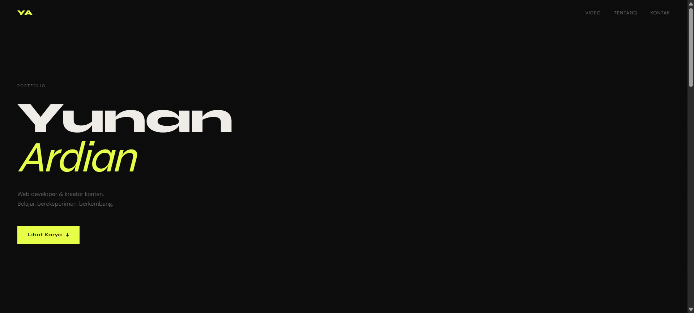

# 🎬 Yunan Ardian — Video Portfolio

Website portfolio pribadi untuk menampilkan karya video, eksplorasi kreatif, dan perjalanan belajar web development.

---

## 📌 Deskripsi

Project ini merupakan website portfolio berbasis HTML, CSS, dan JavaScript yang menampilkan:
- Video karya (YouTube embed)
- Informasi personal
- Form kontak
- Animasi interaktif

Dibangun sebagai bagian dari proses belajar dan eksplorasi frontend development.

---

## 🚀 Fitur

- 🎥 Embed video dari YouTube
- ✨ Animasi scroll reveal
- 🎯 Interaksi navbar aktif
- ⚡ Hover effect pada video card
- 📨 Form kontak dengan validasi JavaScript
- 📱 Responsive design (mobile friendly)

---

## 🛠️ Teknologi

- HTML5
- CSS3 (Custom properties & responsive layout)
- JavaScript (DOM manipulation & event handling)

---

## 📷 Preview

---

## 📂 Struktur Project
