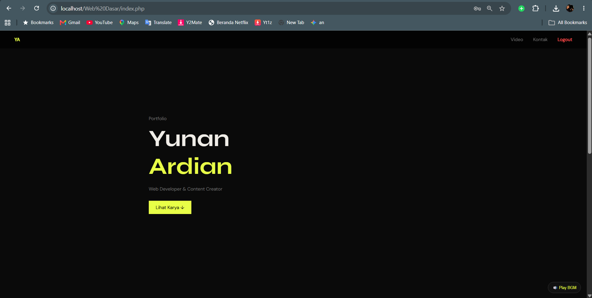
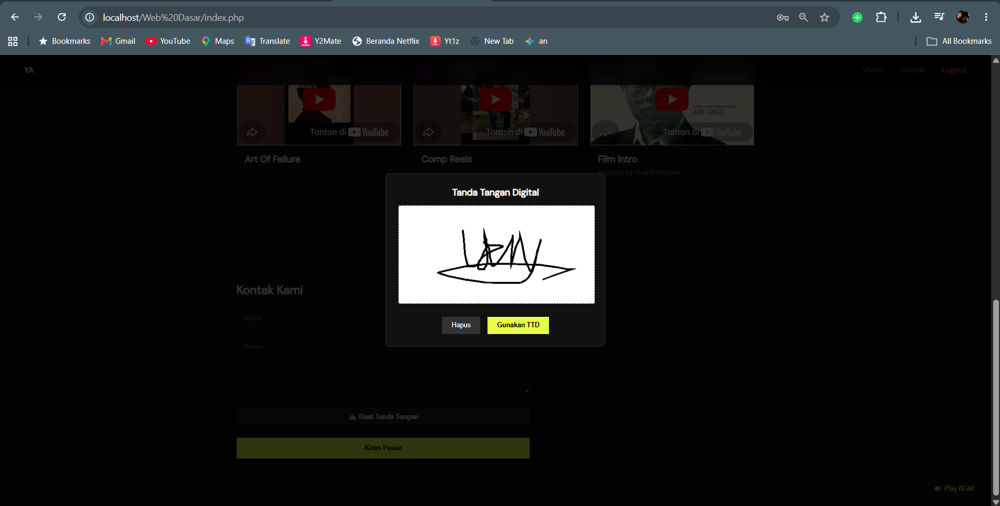
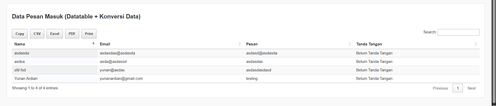
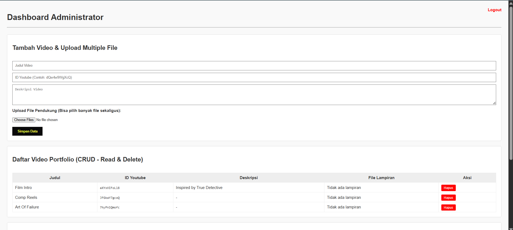

# 🎬 Yunan Ardian — Video Portfolio

Website portfolio pribadi untuk menampilkan karya video, eksplorasi kreatif, dan perjalanan belajar web development.

---

## 📌 Deskripsi

Project ini merupakan website portfolio berbasis HTML, CSS, dan JavaScript yang menampilkan:
- Video karya (YouTube embed)
- Informasi personal
- Form kontak
- Animasi interaktif

Dibangun sebagai bagian dari proses belajar dan eksplorasi frontend development.

---

## 🚀 Fitur

- 🎥 Embed video dari YouTube langsung dari database
- ✨ Animasi scroll reveal dan transisi CSS interaktif pada video card
- 🎯 Interaksi navbar aktif
- 🔐 Sistem Login Multi-Role (Admin & User/Pengunjung) menggunakan Session PHP
- 📨 Form kontak terintegrasi dengan popup **Modal** dan **Canvas Tanda Tangan Digital (TTD)**
- 📁 CRUD Manajemen Video Konten lengkap dengan **Multiple File Upload** di area Admin
- 📊 **DataTables** pada panel admin yang mendukung Pencarian Data otomatis serta Konversi/Ekspor data (PDF, Excel, CSV, Print)
- 🎵 Pengontrol audio latar belakang (BGM) interaktif menggunakan HTML5 Audio API
- 📱 Responsive design (mobile friendly)

---

## 🛠️ Teknologi & Library

- **Core Back-End:** PHP 8.x (Native Terstruktur), MySQLi Data Driver.
- **Core Front-End:** HTML5, CSS3 Custom Properties (Variabel), JavaScript Vanilla.
- **Library Eksternal (CDN):**
  - jQuery 3.6.0 (Ketergantungan DataTables)
  - DataTables Core Engine 1.13.6 (Pencarian & Pagination)
  - DataTables Buttons Extension 2.4.1 (Modul Ekspor Data)
  - JSZip & PDFMake (Kompilasi dokumen Excel & PDF pada sisi klien)
- **Font & Estetika:** Syne Font & DM Sans Font via Google Fonts.

---

## 📷 Preview

   
 

---

## 📂 Struktur Project
project/
│
├── admin/                  # FOLDER BARU: Area Panel Kontrol Administrator
│   ├── index.php           # Dashboard Admin: Form CRUD, Multiple Upload, & DataTables
│   ├── cek_sesi.php        # Middleware Satpam: Validasi Sesi & Proteksi Hak Akses Role
│   └── uploads/            # Tempat penyimpanan berkas hasil Multi-Upload
│
├── koneksi.php             # Koneksi database MySQL
├── login.php               # Gerbang utama masuk sistem (Multi-Role)
├── logout.php              # Penghapus sesi login
├── index.php               # Halaman depan portfolio publik (Front-End)
├── kirim.php               # Proses simpan form kontak & data string Canvas TTD
├── style.css               # Gaya tampilan halaman (ditambahkan style Modal & BGM)
└── README.md

## 🔄 Update Terbaru

### v3.0 (Sistem Manajemen & Keamanan Terintegrasi)
- **Otentikasi Multi-Role:** Menambahkan fitur Login (`login.php`, `logout.php`) memisahkan hak akses `admin` dan `user`.
- **Canvas & Modal TTD:** Menambahkan popup Modal di halaman depan yang berisi HTML5 Canvas untuk tanda tangan digital sebelum mengirim pesan.
- **CRUD & Multiple Upload:** Membuat panel admin khusus di dalam folder `admin/` untuk menambah/menghapus video portfolio sekaligus mengunggah banyak file pendukung sekaligus.
- **DataTables & Konversi:** Mengintegrasikan library DataTables pada panel admin untuk fitur pencarian instan dan tombol ekspor data ke format Excel/PDF.
- **Audio API:** Menambahkan fitur musik latar (BGM) interaktif pada halaman utama portfolio yang bisa dinyalakan/dimatikan oleh user.

### v2.0
- Menambahkan koneksi database MySQL
- Menampilkan video dari database
- Menyimpan form kontak ke database
- Migrasi dari HTML ke PHP